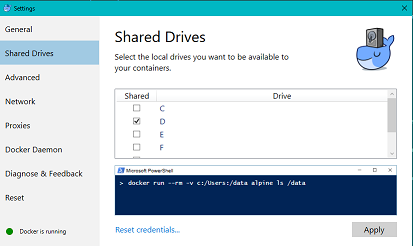
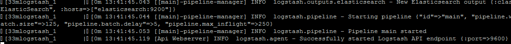
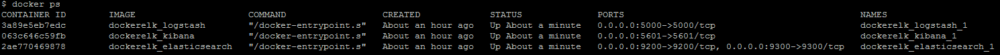
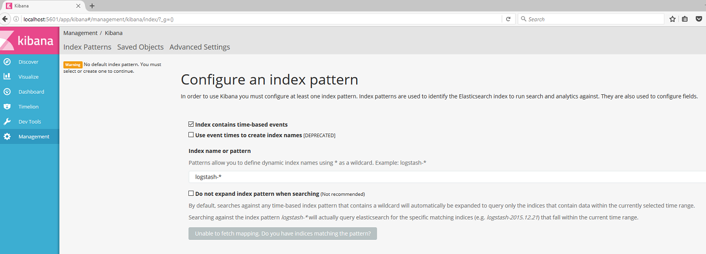
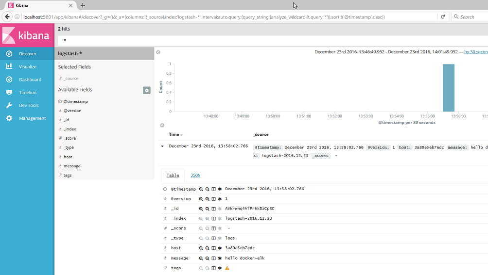

# Elastic Search and Kibana in Docker

Make sure you have Docker and Docker Compose installed. 

Addtionally, you have to share your D: drive in the Docker Settings for this setup to work : 



## Start the stack

Navigate to the directory and start the Docker Elastic stack with the following command :

```bash
docker-compose up
```



You can add the -d flag to run the processes in the background.
  
With **docker ps** you can see that 3 containers are active
  


You can check the connection by opening the kibana UI in a browser on url **http://localhost:5601**.
 


## Initial Configuration

As you can see in the above screenshot, some initial configuration is needed.  
**Kibana**, which is only a viewer, can't do anything as long as there is no data in the Elasticsearch datastore (hence the error message : unable to fetch mappings).  

So start you application and make sure something is logged first (with the default settings a call to the examples API should be sufficient). 

After clicking the Create button, you can check the logged message(s) in the **Discover** tab.



## Stopping the containers

When you are done, you use the **docker-compose down** command to shut everything down : 

```bash
docker-compose down
```
